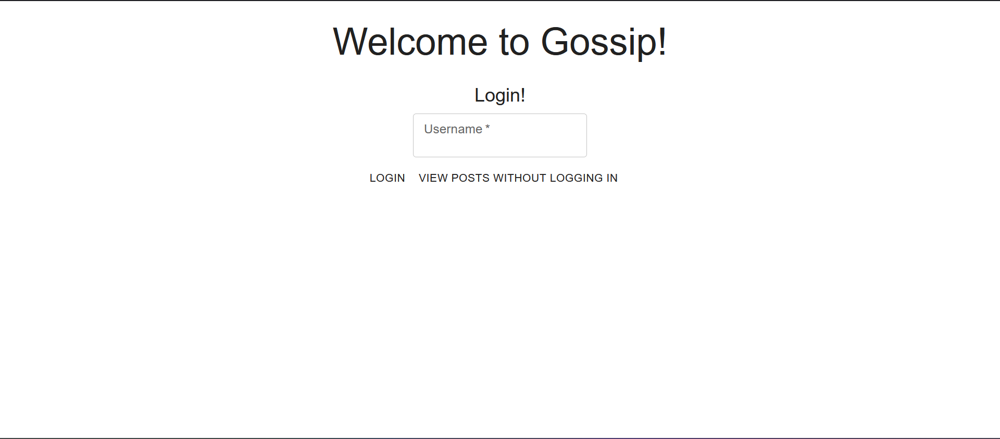

# CVWO 23/24 Assignment Forum Application

This is my submission for the CVWO 23/24 Winter Assignment.

## Pre-requisites

Ensure that you have the following installed on your local machine:
1. Ruby on Rails.[Here's a guide to do so if you don't](https://gorails.com/setup/windows/11)
2. [Node.js](https://nodejs.org/en/download)
   
## Setting Up the App

1. Click on the Code button and download the .zip file.
2. Extract the files to the desired location.
3. Open up the terminal in the directory containing the project files (i.e. if you extracted the files to Desktop, open the terminal in the Desktop/my-forum-main directory).
4. Install Node dependencies:
```bash
npm install
```
5. Install yarn dependencies:
```bash
yarn install
```
6. Install ruby gems:
```bash
bundle install
```
7. Migrate the database:
```bash
rails db:migrate
```
8. Fill the database with initial posts and comments:
```bash
rails db:seed
```
9. Run the app by entering this command:
```bash
bin/dev
```
10. Open [http://localhost:3000](http://localhost:3000) to view it in the browser.

You should see a page like this:

   

